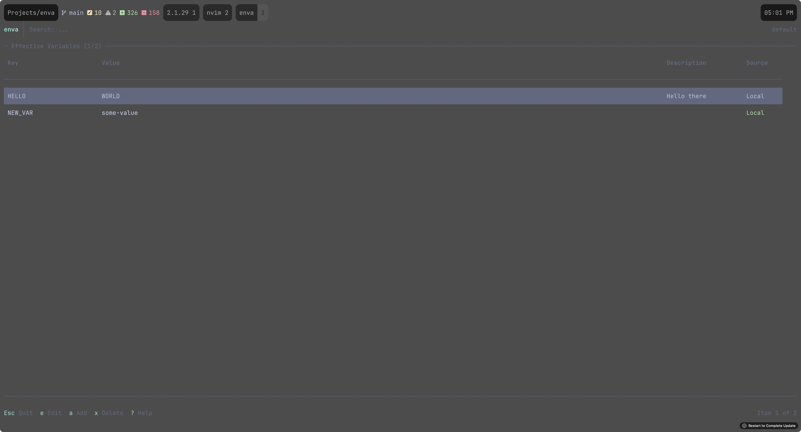

# enva 🌿



**Stop juggling `.env` files. Start managing environment variables like a pro.**

enva is a tiny CLI that stores your env vars in SQLite and loads them automatically as you `cd` around. Set once, inherit everywhere, override when needed. Simple as that.

## ✨ Features

- 🔄 **Auto-loading** — Vars load/unload as you navigate directories
- 📂 **Inheritance** — Set project-wide defaults, override in subdirectories
- 🎨 **Pretty TUI** — Fuzzy search, bulk import, visual editing
- 🎭 **Profiles** — Switch between dev/staging/prod configs
- 🔒 **No `.env` files** — One database, nothing to commit by accident

## 🚀 Quick Start

### Install

```bash
# Homebrew (macOS/Linux)
brew tap nick-skriabin/tap
brew install enva

# Or with Go
go install github.com/nick-skriabin/enva/cmd/enva@latest
```

### Hook into your shell

Add one line to your shell config:

```bash
# Zsh → ~/.zshrc
eval "$(enva hook zsh)"

# Bash → ~/.bashrc
eval "$(enva hook bash)"

# Fish → ~/.config/fish/config.fish
enva hook fish | source
```

Restart your terminal and you're good to go! 🎉

### Try it out

```bash
cd ~/projects/myapp

enva set DATABASE_URL=postgres://localhost/mydb
enva set API_KEY=sk-123456

# Done! These vars now auto-load whenever you enter this directory ✨
```

## 🖥️ The TUI

Just run `enva` to get the interactive interface:

```bash
enva
```

| Key | What it does |
|-----|--------------|
| `j/k` or `↑/↓` | Move around |
| `/` | Fuzzy search |
| `a` | Add variable |
| `e` | Edit selected |
| `x` | Delete |
| `A` | Bulk import |
| `t` | Toggle all/local view |
| `?` | Help |
| `q` | Quit |

## 🛠️ CLI Commands

| Command | What it does |
|---------|--------------|
| `enva` | Open the TUI |
| `enva set KEY=VALUE` | Set a variable |
| `enva unset KEY` | Remove a variable |
| `enva ls` | List all effective vars |
| `enva edit` | Edit in your `$EDITOR` |
| `enva run -- cmd` | Run command with vars loaded |
| `enva export` | Print export statements |
| `enva hook <shell>` | Get shell integration code |

## 🌳 How Inheritance Works

Variables cascade down from parent directories:

```
~/projects/                     DATABASE_URL=postgres://...
└── myapp/                      API_KEY=abc123
    └── backend/                DEBUG=true
```

`cd` into `backend/` and you get all three. Child dirs can override parent values.

### Project Boundaries

enva figures out your project root by looking for:

1. `.enva` file (if you want to be explicit)
2. `.git` directory
3. Falls back to filesystem root

Vars only inherit within the same project.

## 🎭 Profiles

Got multiple environments? Profiles got you:

```bash
# Set up production
ENVA_PROFILE=production enva set API_URL=https://api.example.com

# Development is the default
enva set API_URL=http://localhost:3000

# Switch anytime
export ENVA_PROFILE=production
enva ls  # → shows production vars
```

## 💬 Variable Descriptions

You can add descriptions to document what each var is for:

```bash
# In the TUI there's a description field for each var
# When exported, descriptions become comments:
export API_KEY='sk-123' # Main API key for auth service
```

## 📦 Storage

Everything lives in one SQLite database:

```
~/.local/share/enva/enva.db
```

No scattered `.env` files. No secrets accidentally committed. Just one tidy database.

## 🔧 Build from Source

```bash
git clone https://github.com/nick-skriabin/enva.git
cd enva
go build -o enva ./cmd/enva
sudo mv enva /usr/local/bin/
```

## 📄 License

MIT — do whatever you want with it!
